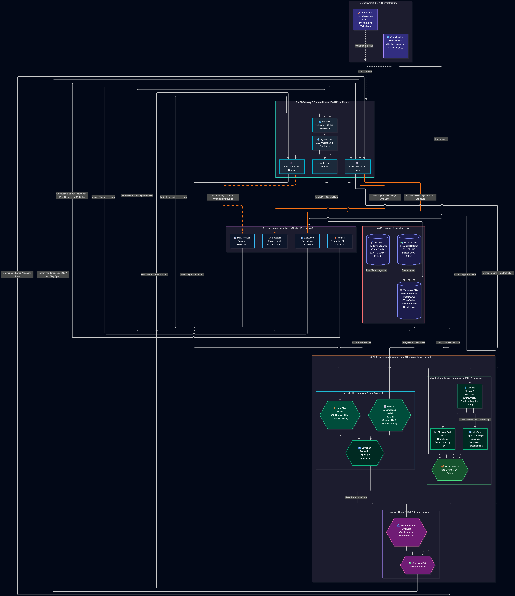

# Freight DSS: AI-Driven Maritime Procurement & Vessel Chartering Optimization
### Smart India Hackathon 2024 | Problem Statement ID: SIH26006 | Ministry of Steel

<p align="center">
  
  
  
  
  
  
  
  
</p>

---

## 📌 2. Executive Summary (The Hook)

> **Freight DSS** is an enterprise-grade Decision Support System engineered for the **Ministry of Steel** to transition Indian Steel PSUs (**SAIL, RINL, NMDC**) from reactive, broker-dependent spot chartering to proactive, mathematically optimized **Contracts of Affreightment (COA)**. By coupling high-frequency machine learning forecasting with Mixed-Integer Linear Programming (MILP), the platform hedges against Baltic freight rate volatility, eliminates costly berth congestion, and mitigates multi-million dollar demurrage penalties—**saving ₹65–₹110+ Crores annually** across sovereign raw material import corridors.

---

## 🌟 3. Core Innovations (The "Wow" Factor)

* **🤖 Hybrid AI Forecasting:** Dual-horizon rate prediction combining **LightGBM** for 15-day high-frequency volatility (lag features, rolling variance, bunker fuel shifts) and **Facebook Prophet** for 180-day macroeconomic and cyclical trends trained on 25 years of Baltic Dry Index telemetry.
* **⚙️ MILP Vessel Optimization:** Operations-research solver built on **PuLP (CBC Engine)** that solves combinatorial fleet assignment across **Handysize, Supramax, Panamax, and Capesize** bulkers while strictly enforcing physical port constraints (*Channel Draft, Length Overall [LOA], Maximum Beam, and Terminal Handling Rates*).
* **🚢 Mid-Sea Lighterage Engine:** Dynamic calculation of **Sandheads / Sagar STS (Ship-to-Ship)** transshipment logistics for shallow riverine ports like **Haldia (12.0m draft limit)**, factoring mother-to-daughter parcel discharge, barge turnaround cycles, and contractual **$3.50/MT lightering surcharges**.
* **📈 Strategic Procurement (Spot vs. COA):** Quantitative financial engine that detects market **Contango vs. Backwardation** curves to recommend locking in 6-month volume-hedged COA contracts versus floating spot fixtures, accounting for route nautical distances and disruption multipliers.
* **🌍 Geopolitical Stress Testing ("What-If" Simulator):** Real-time scenario sandbox modeling black swan disruptions (*Red Sea Houthi attacks, Suez Canal blockage, East Coast Cyclone Season, Panama Canal droughts*) to immediately quantify total landed cost exposure and demurrage escalation.
* **⚖️ True-Cost Accounting:** Advanced objective formulation penalizing idle anchorage waiting times, port turnaround demurrage ($20,000–$35,000/day), and **deadheading / ballast return voyages** to reflect end-to-end landed cost per metric tonne.

---

## 🗺️ 4. System Architecture



### End-to-End Data & Decision Flow
```
┌─────────────────────────┐       HTTP / REST       ┌─────────────────────────┐
│   Next.js 14 Frontend   │ ◄─────────────────────► │    FastAPI REST API     │
│ (Tailwind, Lucide, Recharts)│                       │  (Uvicorn ASGI Engine)  │
└─────────────────────────┘                         └───────────┬─────────────┘
                                                                │
                            ┌───────────────────────────────────┴──────────────────────────────────┐
                            ▼                                                                      ▼
             ┌─────────────────────────────┐                                        ┌─────────────────────────────┐
             │    Hybrid ML Engine         │                                        │   PuLP MILP Solver Engine   │
             │  • LightGBM (1-15 Day Spot) │                                        │  • Fleet Allocation Model   │
             │  • Prophet (16-180 Day COA) │                                        │  • Draft/LOA/Berth Engine   │
             └──────────────┬──────────────┘                                        └──────────────┬──────────────┘
                            │                                                                      │
                            └───────────────────────────────────┬──────────────────────────────────┘
                                                                ▼
                                                    ┌─────────────────────────────┐
                                                    │   TimescaleDB / Postgres    │
                                                    │  (25-Yr BDI & Port Indices) │
                                                    └─────────────────────────────┘
```

1. **Presentation Layer:** Next.js 14 App Router UI providing real-time rate charts, Bloomberg-style COA recommendation matrices, and interactive stress-testing consoles.
2. **API & Orchestration Layer:** FastAPI service processing asynchronous analytical queries, parameter validation (Pydantic v2), and execution pipelines.
3. **Intelligence & Optimization Core:** Hybrid ML models project daily forward curves while the MILP solver evaluates millions of vessel-berth combinations in under 2 seconds.
4. **Data & Telemetry Layer:** TimescaleDB time-series database persisting 25 years of Baltic indices, crude/bunker benchmarks, and calibrated Indian port telemetry.

---

## 🌍 5. Problem Statement Compliance (Ministry of Steel)

| Dimension | Specification & Supported Parameters | Operational Compliance Details |
| :--- | :--- | :--- |
| **Origins Supported** | 🇦🇺 Australia (Newcastle/Hay Point)<br/>🇺🇸 United States (Hampton Roads)<br/>🇲🇿 Mozambique (Maputo/Beira)<br/>🇷🇺 Russia (Ust-Luga/Taman)<br/>🇮🇩 Indonesia (Samarinda/Taboneo) | Full trade lane coverage for Met Coal, Thermal Coal, and Limestone import corridors with route nautical mile (NM) multipliers. |
| **Destinations Supported** | 🇮🇳 Paradip Port<br/>🇮🇳 Visakhapatnam Port (Vizag)<br/>🇮🇳 Gangavaram Port<br/>🇮🇳 Gopalpur Port<br/>🇮🇳 Dhamra Port<br/>🇮🇳 Sagar / Sandheads (Offshore STS)<br/>🇮🇳 Haldia Dock Complex (HDC) | Comprehensive Eastern Coast maritime hub coverage directly serving SAIL (Bhilai, Rourkela, Bokaro, Durgapur, IISCO), RINL (Vizag), and NMDC. |
| **Vessel Classes** | • **Handysize:** 25,000 – 39,999 DWT (Draft: ~10.0m)<br/>• **Supramax:** 40,000 – 64,999 DWT (Draft: ~12.2m)<br/>• **Panamax:** 65,000 – 99,999 DWT (Draft: ~14.5m)<br/>• **Capesize:** 100,000 – 200,000+ DWT (Draft: ~18.5m) | Complete dry bulk classification matching global Baltic indices (`BSI`, `BPI`, `BCI`) with automated parcel sizing and Deadweight (DWT) checks. |
| **Port Constraints Enforced** | • **Channel Draft Limit:** 8.5m to 18.5m safe navigable depth<br/>• **Length Overall (LOA):** 180m to 300m quay allocation limits<br/>• **Maximum Beam:** 28m to 50m lock/channel breadth caps<br/>• **Discharge Rates (TPD):** 8,000 to 50,000 Metric Tonnes/Day | Hard mathematical constraints in MILP solver; strictly prevents grounding risks, berth overruns, and structural lock incompatibilities. |

---

## 🚀 6. Quick Start for Judges (Local Deployment)

Run the entire stack (Frontend, Backend, and TimescaleDB) with a single command via Docker Desktop.

### Prerequisites
* [Docker Desktop](https://www.docker.com/products/docker-desktop/) (v20.10+ recommended)
* [Git](https://git-scm.com/)

### Step-by-Step Instructions

```bash
# 1. Clone the repository
git clone https://github.com/Dhruv727876/SIH2026.git
cd SIH2026

# 2. Build and run all microservices with Docker Compose
docker-compose up --build
```

### Accessing the Platform
Once the build completes and containers report healthy status:

| Service | Endpoint URL | Description |
| :--- | :--- | :--- |
| **Frontend Web App** | [http://localhost:3000](http://localhost:3000) | Next.js Command Center & Procurement Dashboard |
| **FastAPI Interactive Docs** | [http://localhost:8000/docs](http://localhost:8000/docs) | Swagger UI for exploring and testing analytical endpoints |
| **TimescaleDB Database** | `localhost:5432` | Hypertable store (`user: admin`, `password: admin`) |

---

## 🎯 7. Recommended Demo Scenarios (Judges' Cheat Sheet)

Follow these 3 curated test cases to witness the system's core algorithmic capabilities:

```
┌───────────────────────────────────────────────────────────────────────────────────────────────────┐
│ 🌟 SCENARIO 1: Mid-Sea Lighterage at Shallow Riverine Ports (Haldia)                              │
├───────────────────────────────────────────────────────────────────────────────────────────────────┤
│ • Inputs: Consignment: 150,000 MT Coking Coal | Origin: Australia | Destination: Haldia           │
│ • Expected Result:                                                                                │
│   1. System detects Haldia's maximum safe draft of 12.0m (Capesize laden draft is 17.5m).          │
│   2. Triggers the Amber "Mid-Sea Lighterage Required" warning badge.                              │
│   3. Dynamic STS allocation at Sandheads transshipment anchorage with $3.50/MT daughter lighterage│
│      penalty calculated in the final landed cost breakdown.                                       │
└───────────────────────────────────────────────────────────────────────────────────────────────────┘
```

```
┌───────────────────────────────────────────────────────────────────────────────────────────────────┐
│ 🌟 SCENARIO 2: Strategic Procurement (Spot vs. 6-Month COA Hedging)                               │
├───────────────────────────────────────────────────────────────────────────────────────────────────┤
│ • Inputs: Consignment: 300,000 MT Met Coal | Origin: Mozambique | Destination: Paradip            │
│ • Expected Result:                                                                                │
│   1. High-frequency LightGBM and Prophet detect market in Contango (forward spot curve rising).    │
│   2. Displays the Bloomberg-style "Spot vs. COA Strategic Recommendation Card".                   │
│   3. Quantifies explicit cost arbitrage, recommending 6-month COA lock-in saving ₹8.4+ Crores      │
│      against projected spot volatility.                                                           │
└───────────────────────────────────────────────────────────────────────────────────────────────────┘
```

```
┌───────────────────────────────────────────────────────────────────────────────────────────────────┐
│ 🌟 SCENARIO 3: Black Swan Geopolitical Crisis Stress-Testing                                      │
├───────────────────────────────────────────────────────────────────────────────────────────────────┤
│ • Inputs: Navigate to the "What-If Disruption Simulator" tab. Select "Red Sea Crisis".            │
│ • Expected Result:                                                                                │
│   1. Automatically applies Cape of Good Hope rerouting (+14 days voyage time, 1.35x rate shock). │
│   2. Instantly updates financial exposure, showing ₹18.2 Crore surge in demurrage & bunker costs. │
│   3. MILP solver dynamically reschedules shipments to alternative non-disrupted origin lanes.     │
└───────────────────────────────────────────────────────────────────────────────────────────────────┘
```

---

## 📂 8. Project Structure

```text
SIH2026/
├── frontend/                     # Next.js 14 Web Application
│   ├── app/                      # Next.js App Router pages & API routes
│   ├── components/               # Enterprise React UI components
│   │   ├── views/                # ForecastingView, WhatIfView, OptimizerView
│   │   └── ui/                   # Reusable glassmorphic UI widgets
│   ├── public/                   # Static assets, branding & maritime icons
│   └── package.json              # Frontend dependencies & scripts
├── backend/                      # FastAPI Backend Services
│   ├── main.py                   # ASGI application entrypoint & CORS config
│   ├── routers/                  # Modular API routes
│   │   ├── market_data.py        # Live & historical freight rates
│   │   ├── forecasts.py          # ML model inference endpoints
│   │   ├── optimize.py           # MILP fleet chartering solver
│   │   └── disruptions.py        # Geopolitical stress simulation
│   ├── models/                   # Pydantic schemas & SQLAlchemy ORM tables
│   │   ├── port_data.py          # Calibrated draft/LOA/handling specs
│   │   └── vessel_data.py        # Bulker capacities, hire & demurrage rates
│   └── requirements.txt          # Python microservice dependencies
├── ml_engine/                    # Machine Learning & Optimization Core
│   ├── models/                   # LightGBM & Prophet model definitions
│   ├── optimization/             # PuLP MILP formulation & CBC solver logic
│   └── data_pipeline/            # 25-Year Baltic historicals & Kaggle ETL
├── docs/                         # Project Documentation & Architectural Specs
│   ├── architecture.png          # System architecture visual diagram
│   ├── JUDGES_GUIDE.md           # Evaluation rubric & deep-dive questions
│   ├── DEMO_SCRIPT.md            # Grand Finale live demonstration guide
│   └── PROJECT_ANALYSIS_REPORT.md# Technical analysis & mathematical proofs
├── docker-compose.yml            # Multi-container orchestration (TimescaleDB, API, Web)
├── DEPLOYMENT.md                 # Production cloud deployment guide (Vercel/Render)
└── README.md                     # Main project documentation
```

---

## 📄 9. Documentation

For an in-depth review of our mathematical modeling, live demonstration steps, and cloud setups, consult our dedicated guides:

* 📖 **[Judges' Evaluation Guide](./docs/JUDGE_QA.md)**: Deep-dive answers on model accuracy, edge cases, and MILP convergence.
* 🎬 **[Live Demo Script](./docs/DEMO_SCRIPT.md)**: Step-by-step walkthrough script for the 10-minute presentation.
* 🏗️ **[System Architecture Specifications](./docs/architecture.md)**: Comprehensive architectural decisions and component interfaces.
* ☁️ **[Production Cloud Deployment Guide](./DEPLOYMENT.md)**: Detailed guide on Vercel, Render, and Neon DB configurations.

---

## 👥 10. Team & Acknowledgements

### Team Name: **CodeNavigators** (SIH26006)
*College / Institution: [Insert College Name / University Name Here]*

| Team Member | Role | Core Responsibility |
| :--- | :--- | :--- |
| **[Member 1 - Team Lead]** | Lead Full-Stack & System Architect | Next.js 14 UI, Cloud Orchestration, API Design |
| **[Member 2]** | Machine Learning & Quant Engineer | LightGBM Volatility, Prophet Trends, Kaggle ETL |
| **[Member 3]** | Operations Research Specialist | PuLP MILP Solver, Lighterage Logistics Model |
| **[Member 4]** | Backend & Database Engineer | TimescaleDB / Neon, FastAPI Endpoints, Caching |
| **[Member 5]** | Frontend & Visualization Developer | Recharts Dashboards, Glassmorphism UX, Interactive Controls |
| **[Member 6]** | Domain & Policy Analyst | Ministry of Steel Requirements, Port Specs, Demurrage Economics |

### Institutional Acknowledgements
We express our sincere gratitude to:
* **Ministry of Steel, Government of India**: For framing a high-impact problem statement that tackles critical inefficiencies in sovereign maritime procurement.
* **Smart India Hackathon 2024 / MoE Innovation Cell**: For organizing the world's largest open innovation hackathon and empowering student engineers.
