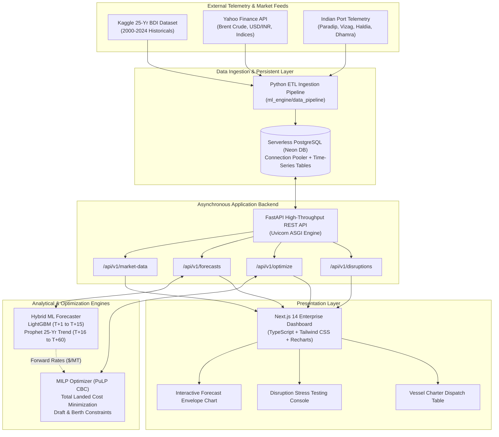

# Freight DSS | SIH26006
### Intelligent Chartering Command Center for Steel Manufacturing Logistics

[](https://www.sih.gov.in/)
[](https://steel.gov.in/)
[](https://nextjs.org/)
[](https://fastapi.tiangolo.com/)
[](https://neon.tech/)
[](https://coin-or.github.io/pulp/)
[](https://opensource.org/licenses/MIT)

---

## 🌐 Live Production Deployment

| Service | Target Environment | Live Link |
| :--- | :--- | :--- |
| **Frontend Web App** | Vercel (Next.js 14 App Router) | [🔗 Launch Command Center](https://your-frontend-app.vercel.app) |
| **Backend REST API** | Render (FastAPI + Uvicorn) | [🔗 Explore OpenAPI / Swagger Docs](https://your-backend-app.onrender.com/docs) |
| **Pitch & Demo Video** | YouTube (3-Minute Walkthrough) | [📺 Watch System Demo](https://youtu.be/your-demo-video-id) |

---

## 📌 Executive Summary

India's primary steel public sector undertakings (**SAIL, RINL, NMDC**) import over **70+ Million Tonnes (MT)** of coking coal and raw bulk cargo annually across high-risk maritime corridors. **Freight DSS (SIH26006)** is a mission-critical Decision Support System engineered for the **Ministry of Steel** that bridges forward freight rate forecasting with operational port constraints. By coupling a two-tier **Hybrid Machine Learning model (LightGBM + Facebook Prophet)** with a **Mixed-Integer Linear Programming (MILP)** optimization solver, Freight DSS dynamically schedules dry bulk vessel chartering (Capesize, Panamax, Supramax) to minimize total landed logistics costs under strict channel draft limits, berth waiting times, and geopolitical disruption shocks.

> **Macro Impact:** A 3–5% optimization in bulk freight charter scheduling saves Indian Steel PSUs between **₹65 Crore and ₹110 Crore annually**, drastically mitigating demurrage penalties and volatile spot-market premiums.

---

## 🛑 The Problem Statement (Business Context)

Indian steelmakers operate under thin margins where raw material transportation forms **15–22% of total production cost**. Procurement teams face three systemic challenges:

* **Extreme Freight Volatility:** Dry bulk indices (Baltic Capesize `BCI`, Baltic Panamax `BPI`, Baltic Supramax `BSI`) frequently experience sudden **30% to 50% swings** within single 30-day windows triggered by bunker fuel inflation, vessel availability imbalances, and macro shocks.
* **Devastating Demurrage Penalties:** Bottlenecks at Indian east coast ports result in vessel waiting queues lasting 24–72+ hours. At standard contractual demurrage rates of **$20,000 to $35,000/day per vessel**, demurrage drain costs Indian PSUs tens of millions of dollars each year.
* **Rigid Physical Port Draft Limits:** Ports such as Haldia enforce a shallow maximum draft of **12.0 meters**, physically barring deep-draft Capesize bulkers (requiring $\ge 17.0\text{m}$). Without automated multi-port constraint intelligence, charters risk dangerous vessel grounding, expensive mid-sea lightering, or severe deadfreight fees.
* **Fragmented, Heuristic Procurement:** Charter decisions have historically relied on retrospective spreadsheets and fragmented broker calls, failing to systematically synthesize macroeconomic market forecasting with real-time port telemetry.

---

## ⚡ Core Features & Competitive Differentiators

### 1. Two-Tier Hybrid ML Forecasting Engine
* **Short-Term Horizon (Days 1–15):** LightGBM gradient boosted trees capture high-frequency volatility, trained on rolling mean, rolling standard deviation, lag features, day-of-week seasonality, and bunker fuel price shifts.
* **Medium-Term Horizon (Days 16–60):** Facebook Prophet / Statsmodels Holt models learn macroeconomic cyclicality and quarterly seasonal swings, enriched with **25 years of historical Kaggle Baltic Dry Index telemetry**.
* **Statistical Confidence Envelopes:** Every daily projection produces an **80% confidence interval** (Lower & Upper bounds), enabling risk-averse procurement strategies.

### 2. Operations Research MILP Optimization (PuLP CBC Solver)
* Replaces naive rule-of-thumb chartering with mathematically optimal vessel selection.
* Solves the discrete allocation problem: determines exact vessel parcel counts ($x_{v,t} \in \mathbb{Z}_{\ge 0}$) across Capesize (150,000 MT), Panamax (80,000 MT), and Supramax (50,000 MT) bulkers over a flexible 15- to 60-day planning window.
* Automatically eliminates vessel classes exceeding target port draft thresholds.

### 3. Maritime Disruption Stress Testing ("What-If" Engine)
* Simulates the supply-chain shockwaves of critical maritime black swan events:
  * **Suez Canal Obstruction:** BDI shock multiplier $+1.45\times$
  * **Red Sea Security Crisis:** BDI shock multiplier $+1.35\times$
  * **Eastern Coast Cyclone Season:** Port waiting time $+48\text{ hours}$
  * **Panama Canal Drought:** Route diversion penalty $+1.25\times$

### 4. Trade Lane Specificity & Landed Cost Breakdown
* Accounts for realistic origin-to-destination nautical voyage lengths:
  * **Australia (Newcastle) $\rightarrow$ Indian Coast:** $\sim 5,200\text{ NM}$ (Normalized multiplier $1.0\times$)
  * **Indonesia (Samarinda) $\rightarrow$ Indian Coast:** $\sim 2,600\text{ NM}$ (Normalized multiplier $0.85\times$)
* Dual-currency transparency displaying landed expenditures in both **USD ($)** and **INR (₹ Crores)**.

---

## 🏛️ System Architecture



---

## 📐 Mathematical Formulation (MILP)

The core vessel charter scheduling problem is formulated as a **Mixed-Integer Linear Program (MILP)** solved via the Branch-and-Cut CBC algorithm.

### 1. Sets and Indices
* $T = \{1, 2, \dots, H\}$: Discrete planning horizon in days ($H \in [15, 60]$).
* $V = \{\text{Capesize}, \text{Panamax}, \text{Supramax}\}$: Available dry bulk vessel classes.
* $p \in P$: Destination discharge port (e.g., Paradip, Haldia, Visakhapatnam).
* $m \in M$: Origin trade lane (e.g., Australia Newcastle, Indonesia Samarinda).

### 2. Parameters
* $D_{\text{required}}$: Total coking coal / iron ore demand to be transported ($\text{Metric Tonnes}$).
* $C_v$: Cargo carrying capacity of vessel class $v$ ($\text{MT}$).
* $F_{v,t}$: Predicted market freight rate per metric tonne for vessel class $v$ departing on day $t$ ($\$/\text{MT}$).
* $R_m$: Nautical route distance multiplier for origin $m$.
* $H_v$: Contractual daily vessel charter hire rate ($\$/\text{day}$).
* $K_{\text{demurrage}}$: Industry standard daily demurrage penalty rate ($\$25,000/\text{day}$).
* $W_p$: Expected berth waiting and discharge queue duration at port $p$ ($\text{days}$).
* $d_v$: Minimum laden vessel draft requirement for class $v$ ($\text{meters}$).
* $\text{Draft}^{\max}_p$: Maximum safe navigational channel draft limit at port $p$ ($\text{meters}$).
* $B^{\max}_{p,t}$: Maximum simultaneous vessel discharge capacity at port $p$ on day $t$.

### 3. Decision Variables
* $x_{v,t} \in \mathbb{Z}_{\ge 0}$: Integer number of vessels of class $v$ scheduled to depart on day $t$.

### 4. Objective Function
Minimize the **Total Landed Logistics Cost** over the entire planning horizon:

$$\min_{x} \quad \mathcal{Z} = \sum_{t=1}^{H} \sum_{v \in V} \underbrace{\left( F_{v,t} \cdot C_v \cdot R_m \right) x_{v,t}}_{\text{Total Voyage Freight Cost}} \;+\; \sum_{t=1}^{H} \sum_{v \in V} \underbrace{\left( K_{\text{demurrage}} \cdot W_p \right) x_{v,t}}_{\text{Estimated Port Demurrage Cost}}$$

### 5. Constraints

#### A. Demand Satisfaction Constraint
The aggregate cargo delivered across all chartered vessels must meet or exceed the total target consignment:
$$\sum_{t=1}^{H} \sum_{v \in V} C_v \cdot x_{v,t} \;\ge\; D_{\text{required}}$$

#### B. Physical Port Draft Feasibility Constraint
A vessel class cannot be allocated to a port whose maximum safe depth is shallower than the vessel's required draft:
$$x_{v,t} = 0, \quad \forall t \in T, \; \forall v \in V \quad \text{such that } d_v > \text{Draft}^{\max}_p$$
*(e.g., Capesize requiring $17.0\text{m}$ draft is strictly forced to $0$ for Haldia with $12.0\text{m}$ limit).*

#### C. Berth Handling Throughput Limit
The total number of vessels berthed on any individual day cannot exceed port infrastructure capacity:
$$\sum_{v \in V} x_{v,t} \;\le\; B^{\max}_{p,t}, \quad \forall t \in T$$

#### D. Non-Negativity and Integrality
Vessel charters must be discrete, non-divisible whole entities:
$$x_{v,t} \in \{0, 1, 2, \dots\}, \quad \forall v \in V, \; \forall t \in T$$

---

## 🛠️ Technology Stack

| Layer | Technology | Version / Tooling | Architectural Purpose |
| :--- | :--- | :--- | :--- |
| **Frontend Framework** | **Next.js 14** | React 18, App Router, TypeScript | Enterprise analytical dashboard and interactive controls |
| **Styling & Icons** | **Tailwind CSS** | Tailwind CSS, Lucide React | Modern responsive design, dark mode theme, glassmorphism |
| **Data Visualization**| **Recharts** | Canvas / SVG Recharts | 60-day forecast curves, confidence envelopes, cost distributions |
| **Backend Framework** | **FastAPI** | Python 3.11+, Uvicorn ASGI | Asynchronous REST endpoints, OpenAPI auto-docs, CORS management |
| **Database ORM** | **SQLAlchemy 2.0** | PostgreSQL Dialect, Pydantic V2 | Strong data typing, schema validation, and relational mapping |
| **Database Cloud** | **Neon PostgreSQL** | Serverless Postgres + Connection Pooler | Scalable cloud database for market time-series & port logs |
| **Local Fallback DB** | **SQLite 3** | Zero-downtime SQLAlchemy driver | Local dev sandbox & resilience if cloud connection drops |
| **ML Volatility** | **LightGBM** | Microsoft LightGBM, Scikit-Learn | T+1 to T+15 short-term autoregressive rate forecasting |
| **ML Seasonal Trend**| **Prophet** | Facebook Prophet, Statsmodels Holt | T+16 to T+60 long-horizon seasonal cycle projections |
| **Optimization** | **PuLP** | COIN-OR CBC Solver | Mixed-Integer Linear Programming for constrained scheduling |
| **Cloud Hosting** | **Vercel & Render** | Global Edge CDN + Managed Python | Production cloud hosting with automated CI/CD push triggers |

---

## 📊 Data Sources & Integrity

The intelligence layer is grounded in authentic global maritime datasets rather than purely synthetic assumptions:

1. **25-Year Historical Shipping Rates (Kaggle)**:
   * File: `ml_engine/data_pipeline/raw_data/shipping_rates.csv`
   * Spans **2000 to 2024** containing monthly Baltic Dry Index points, global container spot rates, Aframax tanker rates, and supply chain pressure indices.
2. **Historical Geopolitical Disruption Events (Kaggle)**:
   * File: `ml_engine/data_pipeline/raw_data/disruption_events.csv`
   * Calibrated against real historical shocks (2021 Suez obstruction, Red Sea attacks, COVID-19 port lockdowns, Panama canal transit restrictions).
3. **Live Macroeconomic Indicators (`yfinance`)**:
   * Live daily tracking of **Brent Crude Oil (`BZ=F`)** for marine bunker fuel covariance.
   * Real-time **USD to INR currency exchange rate (`USDINR=X`)** for foreign exchange conversion.
4. **Calibrated Indian Port Telemetry**:
   * Physical channel draft limits and berth turnaround times modeled for:
     * **Paradip:** $17.5\text{m}$ draft (Capesize compliant)
     * **Visakhapatnam:** $16.5\text{m}$ draft (Panamax / light Capesize)
     * **Haldia:** $12.0\text{m}$ shallow riverine draft (Supramax only)
     * **Kandla, Chennai, Mumbai, JNPT, Dhamra**

---

## 🚀 Local Development & Quickstart

### Prerequisites
* **Python 3.11+** installed
* **Node.js 18+** & **npm** installed
* **Git** installed

```bash
# 1. Clone the repository
git clone https://github.com/Dhruv727876/SIH2026.git
cd SIH2026
```

### Step 1: Set Up Backend & Python Virtual Environment
```bash
# Create virtual environment
python -m venv venv

# Activate virtual environment
# Windows (PowerShell):
.\venv\Scripts\Activate.ps1
# Linux / macOS:
source venv/bin/activate

# Install backend & ML dependencies
pip install -r backend/requirements.txt
```

### Step 2: Configure Environment Variables
```bash
# In backend directory, create .env from example
cd backend
cp .env.example .env
# Optional: Replace DATABASE_URL with your Neon DB connection string
cd ..
```

### Step 3: Seed Database with Kaggle 25-Year Market Data
```bash
# Run database seeding script (populates ~1,300+ time-series records & port data)
python ml_engine/data_pipeline/seed_database.py
```

### Step 4: Launch FastAPI Backend Server
```bash
cd backend
python -m uvicorn main:app --reload --port 8000
```
> Interactive API Documentation (Swagger) is live at: **[http://127.0.0.1:8000/docs](http://127.0.0.1:8000/docs)**

### Step 5: Launch Next.js Frontend Dashboard
```bash
# Open a new terminal window
cd frontend
npm install
npm run dev
```
> Access the Command Center Web UI at: **[http://localhost:3000](http://localhost:3000)**

---

## ☁️ Production Cloud Deployment Architecture

The application is architected for zero-downtime cloud availability across distributed serverless platforms:

```text
       [End Users / Steel PSU Officers]
                      │
                      ▼
         [Vercel Global Edge Network]
      Next.js 14 Frontend Web Application
                      │
                      │ HTTPS REST (Axios /api/v1)
                      ▼
            [Render Cloud Web Service]
     FastAPI Backend + ML Engine + PuLP Solver
        (Dynamic PORT 10000, 0.0.0.0 Binding)
                      │
                      │ TLS 1.3 Pooled Queries
                      ▼
           [Neon Serverless PostgreSQL]
    Time-Series Hypertable Storage & Audit Logs
```

* **Frontend (Vercel):** Automated Git deployments, edge-cached static assets, and client-side reactive rendering using Next.js 14 App Router.
* **Backend (Render):** Dockerized Python web process managed by `Procfile`, automatically mapping incoming traffic to `uvicorn main:app --host 0.0.0.0 --port $PORT`.
* **Database (Neon DB):** Serverless PostgreSQL instance with connection pooling enabled (`pool_pre_ping=True`) for high-concurrency resilience.

---

## 👥 Team & Acknowledgments

**Smart India Hackathon 2026**  
* **Problem Statement ID:** SIH26006  
* **Theme:** Transportation & Logistics / Decision Support Systems  
* **Category:** Software  

### Team Members
* **[Team Lead / Full-Stack & DevOps Engineer]** - System Architecture, Next.js UI, Cloud CI/CD
* **[ML / Data Engineer]** - LightGBM, Prophet, Kaggle 25-Year Ingestion Pipeline
* **[Optimization & Backend Engineer]** - PuLP MILP Mathematical Modeling & FastAPI
* **[Domain & Research Specialist]** - Maritime Port Telemetry & Steel PSU Logistics

### Special Acknowledgments
We extend our deepest gratitude to:
* **The Ministry of Steel, Government of India**, for defining an industry-critical problem statement addressing real-world bulk freight logistics challenges.
* **Smart India Hackathon (AICTE & MoE Innovation Cell)**, for fostering innovation in mission-critical sovereign software infrastructure.

---

<p align="center">
  <b>Freight DSS (SIH26006)</b> • Built with precision for the sovereign industrial supply chain of India.
</p>
